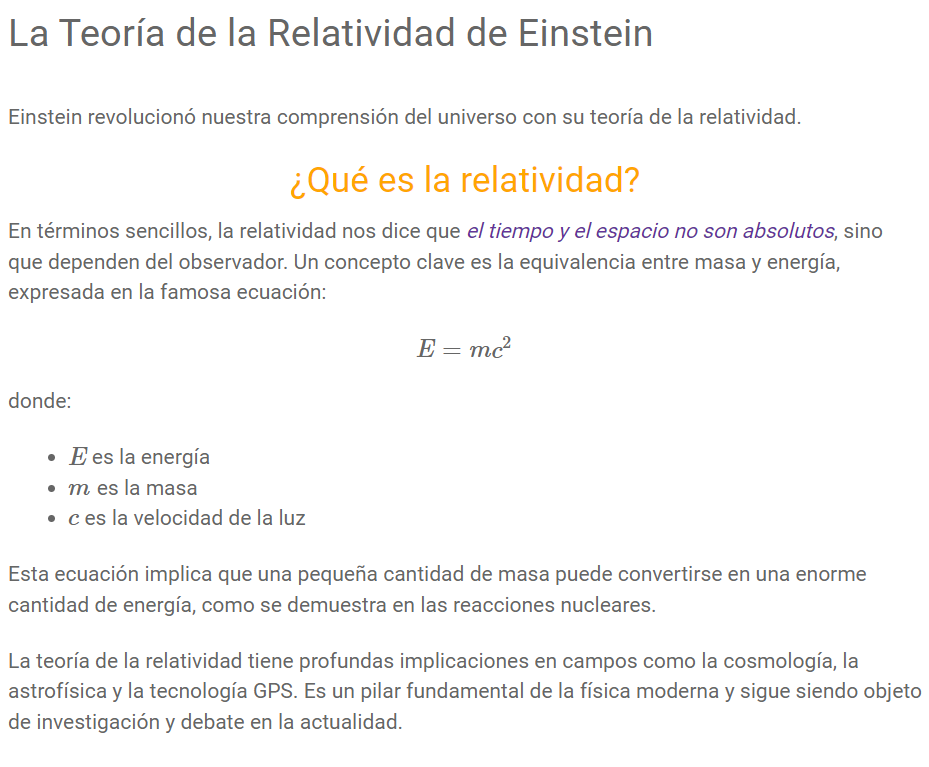

### Introducción

Este potente compilador de texto te permite crear documentos enriquecidos combinando:

- HTML: Estructura y contenido básico.
- CSS (en etiquetas `<style>`): Diseño y presentación visual.
- Bootstrap (clases selectas): Componentes prediseñados para maquetación rápida.
- LaTeX (con MathJax): Fórmulas y expresiones matemáticas.
- Markdown: Sintaxis simplificada para formato de texto.

### Ejemplo

```html {"id":"01J3NFHAQ07CB3MX58TV375TKY"}
# La Teoría de la Relatividad de Einstein #
<br />
<style>
  h2 {
    text-align: center;
    color: hsl(39, 100%, 50%);
  }
  .destacado {
    font-style: italic;
    color: #663399;
  }
</style>

Einstein revolucionó nuestra comprensión del universo con su teoría de la
relatividad.

<h2>¿Qué es la relatividad?</h2>

En términos sencillos, la relatividad nos dice que
<span class="destacado">el tiempo y el espacio no son absolutos</span>, sino que
dependen del observador. Un concepto clave es la equivalencia entre masa y
energía, expresada en la famosa ecuación: 

$$
E = mc^2
$$

donde:

*   @;E;@ es la energía
*   @;m;@ es la masa
*   @;c;@ es la velocidad de la luz

Esta ecuación implica que una pequeña
cantidad de masa puede convertirse en una enorme cantidad de energía, como se
demuestra en las reacciones nucleares. La teoría de la relatividad tiene
profundas implicaciones en campos como la cosmología, la astrofísica y la
tecnología GPS. Es un pilar fundamental de la física moderna y sigue siendo
objeto de investigación y debate en la actualidad.
```

Dando como resultado en algo como esto



En este ejemplo, hemos combinado:

- HTML: Para la estructura básica (encabezado, párrafos).
- Markdown: Para dar formato al texto (negritas, cursivas).
- CSS: Para personalizar el estilo (centrar y colorear el título, resaltar texto).
- LaTeX: Para mostrar la ecuación de Einstein.