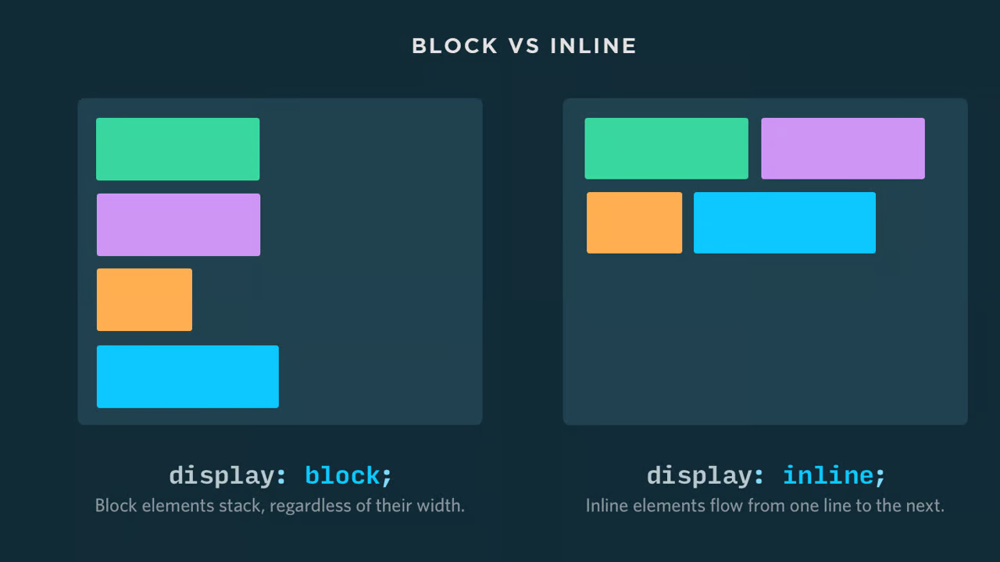

En HTML, los elementos se clasifican en dos categorías fundamentales: elementos de bloque y elementos de línea. Esta distinción es crucial para comprender cómo se estructuran y presentan las páginas web.



## Elementos de Bloque  ##
### ¿Qué son? ###

Los elementos de bloque ocupan todo el ancho disponible de su contenedor padre y siempre comienzan en una nueva línea. Piensa en ellos como cajas apiladas una encima de otra.

### Características: ###

- Ocupan todo el ancho: Se extienden horizontalmente hasta los bordes de su contenedor.
- Forzan un salto de línea: Cada elemento de bloque inicia en una nueva línea, creando una separación visual.
- Contenedores naturales: Pueden contener otros elementos de bloque o de línea.

#### Ejemplos: ####

``<div>``: Contenedor genérico de bloque para agrupar elementos.  
``<p>``: Define un párrafo de texto.  
``<h1>`` a ``<h6>``: Encabezados de diferentes niveles.  
``<ul>`` y ``<ol>``: Listas desordenadas y ordenadas.  
``<table>``: Tablas para datos estructurados.  
``form>``: Formularios para recopilar información del usuario.  

### Casos de Uso: ###

- Estructura de la página: Organizar el contenido en secciones y bloques.
- Diseño de secciones: Crear áreas separadas para encabezados, contenido principal, barras laterales y pies de página.
- Presentación de contenido: Mostrar párrafos, listas, tablas y formularios de manera clara.

## Elementos de Línea ##
### ¿Qué son? ###

Los elementos de línea ocupan solo el espacio necesario para su contenido y fluyen junto con otros elementos en la misma línea. Son como palabras en una oración.

### Características: ###

- Ocupan espacio mínimo: No fuerzan saltos de línea y se adaptan al contenido que contienen.
- Flujo en línea: Se alinean horizontalmente con otros elementos de línea.
- Énfasis y formato: A menudo se utilizan para aplicar estilos a porciones específicas de texto.

#### Ejemplos: ####

``<span>``: Contenedor genérico de línea para aplicar estilos.  
``<a>``: Enlaces a otras páginas o recursos.  
``<strong>``: Texto en negrita para énfasis.  
``<em>``: Texto en cursiva para énfasis.  
````: Imágenes incrustadas en la página.  
``<input>``: Campos de entrada de formularios.  

### Casos de Uso: ###

- Formato de texto: Aplicar estilos como negrita, cursiva, subrayado o enlaces a partes del texto.
- Incrustación de elementos: Insertar imágenes, iconos o campos de formulario dentro de bloques de texto.
- Creación de enlaces: Conectar diferentes secciones de una página o dirigir a los usuarios a recursos externos.

### Tabla Comparativa ###

|Característica      |Elementos de Bloque                                |Elementos de Línea|
|---                 |---                                                |---|
|Ocupación de espacio|Todo el ancho disponible                           | Solo el espacio necesario|
|Salto de línea      |Sí                                                 |No|
|Contenidos          |Otros bloques o líneas                             |Principalmente texto y elementos pequeños|
|Ejemplos            |``<div>``, ``<p>``, ``<h1>``, ``<ul>``, ``<table>``|``<span>``, ``<a>``, ``<strong>``, ``<em>``, ````|

### Consideraciones Adicionales ###

- Algunos elementos pueden comportarse como bloque o línea según el contexto y los estilos aplicados.
- El uso adecuado de elementos de bloque y de línea es esencial para crear páginas web bien estructuradas, legibles y accesibles.